# 🤖 AWS Lambda Error Auto-Fixer

An intelligent system that automatically detects and fixes Lambda function errors using AWS MCP (Model Context Protocol) servers. This system monitors your Lambda functions, analyzes errors using AWS Knowledge, and applies fixes automatically.

## ✨ Features

- 🔍 **Automated Error Detection** - Monitors Lambda functions using CloudWatch metrics
- 🧠 **Intelligent Analysis** - Uses AWS Knowledge MCP to understand error patterns
- 🔧 **Auto-Fix Capability** - Applies fixes using Lambda MCP operations
- 🔄 **Rollback Protection** - Automatically rolls back failed fixes
- 📊 **Comprehensive Monitoring** - Detailed logging and metrics
- ⚡ **Smart Throttling** - Prevents API rate limiting with cooldown periods

## 🏗️ How It Works

```mermaid
graph TD
    A[CloudWatch MCP] -->|getMetricData| B[Error Detection]
    A -->|getLogEvents| C[Log Analysis]
    C --> D[AWS Knowledge MCP]
    D -->|Error Diagnosis| E[Fix Recommendations]
    E --> F[Lambda MCP]
    F -->|updateFunctionCode| G[Apply Fix]
    F -->|publishVersion| H[Deploy Fix]
    F -->|updateAlias| I[Update PROD]
    G --> J[Verification]
    J -->|Success| K[✅ Fix Applied]
    J -->|Failure| L[🔄 Rollback]
```



## 🚀 Quick Start

### 1. Configure MCP Servers

```json
{
  "mcpServers": {
    "aws-knowledge-mcp-server": {
      "url": "https://knowledge-mcp.global.api.aws"
    },
    "aws-cloudwatch-mcp-server": {
      "url": "https://cloudwatch-mcp.global.api.aws"
    },
    "aws-lambda-mcp-server": {
      "url": "https://lambda-mcp.global.api.aws"
    }
  }
}
```

### 2. Set Environment Variables

```bash
# Required
AWS_REGION=us-east-1
MONITOR_FUNCTIONS=my-function1,my-function2
ERROR_THRESHOLD=5

# Auto-fix
ENABLE_AUTO_FIX=true
ENABLE_ROLLBACK=true
MAX_CONCURRENT_FIXES=3
```

### 3. Deploy

```bash
npm install
npm run deploy
```

See [Deployment Guide](deployment-guide.md) for detailed instructions.

## 📋 Supported Fix Types

| Error Type | Auto-Fixable | Description |
|------------|--------------|-------------|
| **Timeout** | ✅ | Increases function timeout configuration |
| **Memory** | ✅ | Increases memory allocation |
| **Dependencies** | ✅ | Adds missing npm packages |
| **Syntax** | ✅ | Fixes JavaScript syntax errors |
| **Runtime** | ✅ | Adds error handling and null checks |
| **Permissions** | ❌ | Requires manual IAM policy updates |

## 🔧 Configuration

### Environment Variables

| Variable | Description | Default |
|----------|-------------|---------|
| `MONITOR_FUNCTIONS` | Functions to monitor (comma-separated) | Required |
| `ERROR_THRESHOLD` | Minimum errors to trigger analysis | `5` |
| `ENABLE_AUTO_FIX` | Enable automatic fixing | `false` |
| `ENABLE_ROLLBACK` | Enable rollback on failure | `true` |
| `MAX_CONCURRENT_FIXES` | Max concurrent fixes | `3` |
| `FIX_COOLDOWN` | Cooldown between fixes (ms) | `300000` |

### MCP Integration

The system uses three AWS MCP servers:

1. **CloudWatch MCP** - Error monitoring and log analysis
2. **Knowledge MCP** - AWS documentation and fix recommendations  
3. **Lambda MCP** - Function updates and deployment

## 📊 Monitoring

### CloudWatch Metrics

- `LambdaAutoFixer/ErrorsDetected` - Number of errors found
- `LambdaAutoFixer/FixesApplied` - Number of fixes applied
- `LambdaAutoFixer/FixSuccessRate` - Success rate percentage
- `LambdaAutoFixer/Rollbacks` - Number of rollbacks

### Logs

All operations are logged to CloudWatch with structured JSON:

```json
{
  "timestamp": "2024-01-15T10:30:00Z",
  "level": "info",
  "functionName": "my-function",
  "action": "fix_applied",
  "fixType": "timeout",
  "success": true,
  "version": "v1234567890"
}
```

## 🛠️ File Structure

```
aws-lambda-error-auto-fixer/
├── lambda-error-orchestrator.js    # Main orchestrator
├── error-monitor.js                # CloudWatch monitoring
├── knowledge-integration.js        # AWS Knowledge MCP
├── lambda-auto-fixer.js           # Lambda MCP operations
├── mcp-config.json                # MCP server configuration
├── package.json                   # Dependencies
├── deployment-guide.md            # Detailed deployment guide
└── README.md                      # This file
```

## 🔒 Security

- **IAM Permissions**: Minimal required permissions
- **API Keys**: Stored securely in environment variables
- **Rollback**: Automatic rollback on fix failure
- **Audit Trail**: Complete CloudTrail logging

## 📈 Performance

- **Concurrent Fixes**: Configurable limit to prevent API throttling
- **Cooldown Periods**: Prevents spam fixing
- **Batch Processing**: Efficient handling of multiple functions
- **Memory Optimization**: Streams large log data

## 🚨 Error Handling

The system includes comprehensive error handling:

- **Fix Verification**: Validates fixes before marking as complete
- **Automatic Rollback**: Reverts failed fixes
- **Graceful Degradation**: Continues monitoring even if some fixes fail
- **Detailed Logging**: Full error context for debugging

## 🔄 Workflow Example

1. **Monitor**: CloudWatch MCP detects 10 errors in `my-function`
2. **Analyze**: Knowledge MCP identifies timeout issues
3. **Recommend**: Suggests increasing timeout to 300 seconds
4. **Apply**: Lambda MCP updates configuration and deploys
5. **Verify**: Confirms timeout was increased successfully
6. **Complete**: Function is now healthy ✅

## 📞 Support

For issues or questions:

1. Check [Deployment Guide](deployment-guide.md)
2. Review CloudWatch logs
3. Check MCP server status
4. Open an issue in this repository

## 📄 License

MIT License - see LICENSE file for details.

---

**🎉 Keep your Lambda functions healthy with intelligent auto-fixing!**